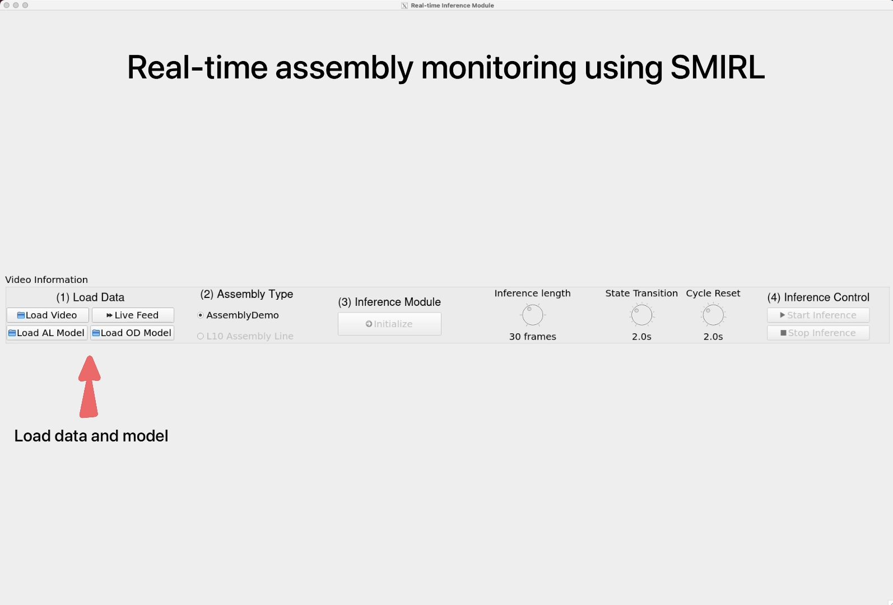

# Assembly guidance system for manufacturing industries

The repository contains the code for an app developed as a part of the research work conducted at the Manufacturing Innovation Network Laboratory (MINLab), UW Madison.

The application contains a GUI that can be used to run inference on assembly datasets using SMIRL (State Machine Integrated Recognition and Localization).

The works related to this repository are published in the following journals:

[1] Selvaraj, V., Al-Amin, M., Yu, X., Tao, W., & Min, S. (2024). Real-time action localization of manual assembly operations using deep learning and augmented inference state machines. Journal of Manufacturing Systems, 72, 504-518.

[2] Selvaraj, V., Al-Amin, M., Tao, W., & Min, S. (2023). Intelligent assembly operations monitoring with the ability to detect non-value-added activities as out-of-distribution (OOD) instances. CIRP Annals.


## Running the Application

After cloning the repository

**Step-1**

Install requirements.txt

```py
pip install -r requirements.txt
```

**Step-2**

``` py
python app.py
```

## GUI

Running the `app.py` should start the GUI as shown below, and the screen recording of the app's operation can be seen [here](https://smartmfg.me.wisc.edu/video/AM_interactive_app.mp4).




## TODO

- [ ] Ability to train models for different assemblies through the app
- [ ] Integration of NVA detection without explicit model training

## Misc

- **Note-1:** For the videos corresponding to the trained weights of the deep learning models, please reach out to the repository owner.
- **Note-2:** The main branch contains the code corresponding to assembly action detection and location without the object detection part.

## Acknowledgements

- YOLOv7 - https://github.com/WongKinYiu/yolov7


